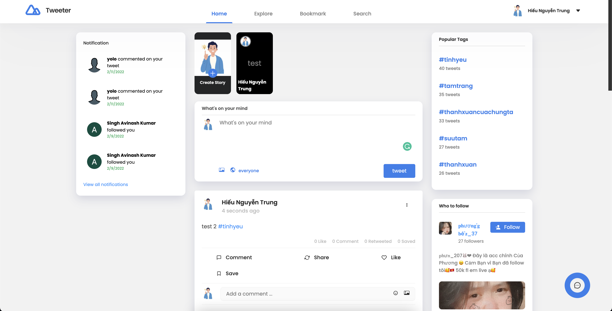

<h1 align="center">Tweeter</h1>

<div align="center">
  <h3>
    <a href="https://twitter.rikikudo.live">
      Demo
    </a>
  </h3>
</div>

<!-- TABLE OF CONTENTS -->

## Table of Contents

- [Overview](#overview)
- [Features](#features)
- [How to use](#how-to-use)

<!-- OVERVIEW -->

## Overview



## Features

- ✅ View/create/edit/delete/like/share/save/comment tweets
- ✅ View/create/delete stories
- ✅ Reply to comments
- ✅ View/edit profile
- ✅ Real time Chat/video call with other users (due to limit of Agora, I disabled video call feature, but the source code does include that part)
- ✅ Search for tweets/hashtags/users
- ✅ View saved / popular tweets, popular users, popular hashtags
- ✅ Real time notifications

## How To Use

<!-- Example: -->

To clone and run this application, you'll need [Git](https://git-scm.com) and [Node.js](https://nodejs.org/en/download/) (which comes with [npm](http://npmjs.com)) installed on your computer. From your command line:

```bash
# Clone this repository
$ git clone https://github.com/trunghieu99tt/Twitter-client

# Fill in .env file with your own values (see .env.example)

# Install dependencies
$ npm install

# Run the app
$ npm start
```
